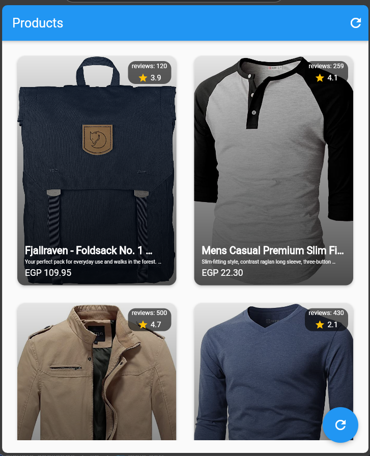

# Elevate Challenge - Flutter E-Commerce App 🛒


A Flutter implementation of an e-commerce product showcase using modern development practices.

## Features ✨
- **Bloc State Management** for predictable state handling
- **Dio Networking** for API communication
- **Product Listing** with grid layout
- **Product Details** view
- **Error Handling** with user-friendly messages
- **Responsive UI** for all screen sizes

## Screenshots 📱
| Products Screen |
|----------------|
|  |

## Architecture 🏗️
lib/
├── screens/ # Application screens
├── shared/ # Reusable components
│ ├── Cubit/ # Business logic
│ ├── model/ # Data models
│ ├── network/ # API communication
│ └── utils/ # Helpers & widgets
└── main.dart # App entry point

## Getting Started 🚀

### Prerequisites
- Flutter SDK (>=3.4.0)
- Dart (>=3.1.0)

### Installation
1. Clone the repository:
   ```bash
   git clone https://github.com/YassenAhmed-gif/elevate_challenge.git
